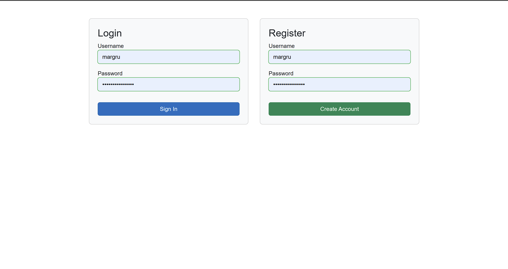
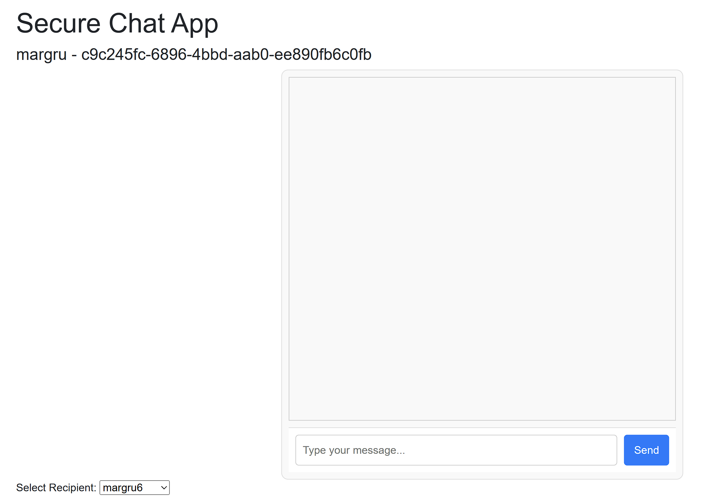

# SSD - Chat Application

A real-time messaging platform implementing end-to-end encryption to ensure confidential communication between two users, protecting against eavesdropping and tampering.

## Project Overview
This application enables secure text-based communication with:
- **Client-side encryption** before message transmission
- **JWT authentication** for user identity verification
- **SignalR** for real-time message delivery
- **Cryptographic integrity checks** to detect message tampering

## Setup & Usage
### Requirements
- .NET 9 runtime
- PostgreSQL database or alternatively InMemoreDatabase (does not work 100% but easier to setup)
- run both Backdnd and Frontend projects

### Installation
1. Clone repository and configure connection strings
2. Set JWT secret in server configuration
3. Launch server and client applications
4. Setup a local PostgreSql db to store users, .sql creation script can be found in the solution root

#### Customise your appsettings.json:
<code>
  "ConnectionStrings": {
    "DefaultConnection": "Host=localhost;Port=5432;Database=ChatApp;Username=postgres;Password="
  }
</code>

## Relevant Encryption Classes
1. crypto.js in wwwroot/js
2. ChatFrontend/Services/EncryptionServices - handles message encrypting and decrypting (uses crypto.js)
3. ChatFrontend/Services/ChatService - handles signalR connections and message sending
4. ChatFrontend/Services/AuthEervice - handling if auth state and JWT tokens

## Message sending workflow
1. User logs in
2. Fetches all users from API
3. Select an user -> send a message
4. Message content gets encrypted by both a hash made up from a combination of recipient and senders public keys 
and a randomly generated IV that gets sent together with the message.
5. Message recipient uses again the sender and their own public key to make a hash together with the received randomly generated
IV key to decrypt the message.

## Key Security Features
1. **End-to-End Encryption**
    - Messages encrypted using AES-GCM algorithm before leaving sender's device
    - Decryption only possible by intended recipient
    - 256-bit encryption keys derived from combined user public keys

2. **Secure Authentication**
    - JSON Web Tokens (JWT) validate user sessions
    - Token-based authorization for chat connections

3. **Message Integrity Protection**
    - Built-in authentication tags in AES-GCM ensure message authenticity
    - Cryptographic hashing prevents undetected message modification

4. **Forward Secrecy Foundations**
    - Unique initialization vector (IV) per message
    - Session-specific encryption key derivation

## Technical Implementation
### Cryptographic Architecture
- **Key Management**: Combined public keys hashed with SHA-256 to create shared secrets
- **Encryption Workflow**:
    1. Random 12-byte IV generated per message
    2. AES-GCM encryption using derived session key
    3. Encrypted payload transmitted with IV metadata

- **Decryption Process**:
    1. Recipient recreates session key using stored public keys
    2. IV from metadata used for ciphertext decryption
    3. Authentication tag verification prevents tampering

### Infrastructure
- **Real-Time Layer**: SignalR
- **Security Layer**:
    - HTTPS transport encryption
    - JWT token validation middleware
    - Encrypted payload handling (server never accesses plaintext)

### User Flow
1. Authenticate with credentials to obtain JWT
2. Exchange public keys through secure channel
3. Initiate encrypted chat session
4. Messages automatically encrypted/decrypted during transmission

## Security Considerations
- **Confidentiality**: Third parties (including server operators) cannot read messages
- **Integrity**: Cryptographic verification prevents message alteration
- **Authentication**: JWT tokens ensure participant identity validity
- **Non-Repudiation**: Message authentication prevents sender denial

## Example encrypted message
<code>
{"type":1,"invocationId":"1","target":"SendPrivateMessage","arguments":[{"content":"D4s1+3WPRR+aVlf0vZnxcNifJA==","encryptionIv":"CvZEpv+x6Mb5Bhhr","sender":"c9c245fc-6896-4bbd-aab0-ee890fb6c0fb","senderName":"margru","senderPublicKey":"BFFTF5ulNbfaHSAuoMXDk1t+R4kKVY4i8lu/j16HzeVsu8CZJDOty1a2xed7yW602CWn0VX5y6o+Ld+YbI7+IoA=","recipient":"34b05242-af2a-4bfa-a343-9ce8aba412be","recipientPublicKey":"BDTU4ONntHwe8cvC4z0/zCXh3TJO49bKLbZHhJBus87GW7GgvlOmjJY3tTIBLY2GqjQ8UVUOkpnhiZugUp4ojbU="}]}	</code>

## App Screenshots

